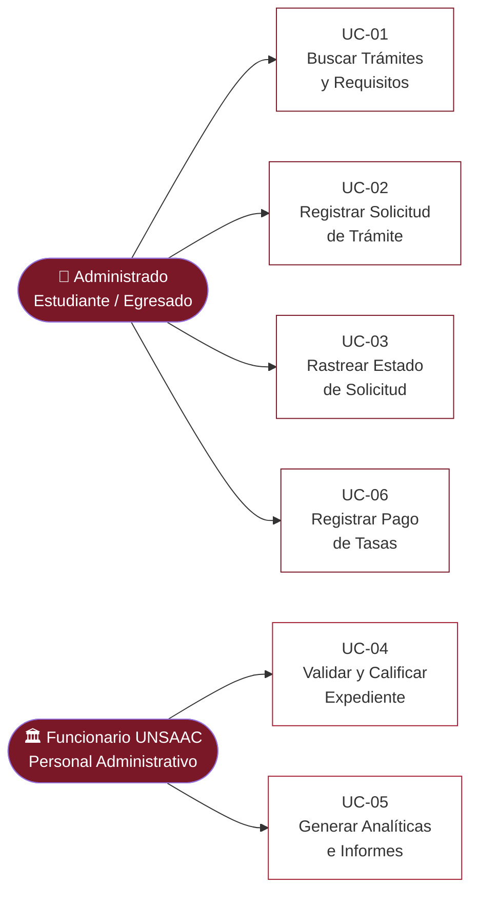

# Documentación de Ingeniería de Software: Plataforma Web TUPA UNSAAC

Este documento constituye la documentación de ingeniería requerida para la **Entrega de Avance** y la **Exposición** de la Plataforma Web para la Optimización de la Gestión del TUPA de la UNSAAC (Semestre 2026-I).

---

## 1. Requerimientos del Sistema

### 1.1. Requerimientos Funcionales (RF)

| Código | Nombre del Requerimiento | Descripción | Prioridad |
| :--- | :--- | :--- | :--- |
| **RF-01** | Búsqueda Dinámica de Trámites | El sistema debe permitir a los usuarios buscar trámites TUPA por código, denominación o palabras clave en tiempo real. | Alta |
| **RF-02** | Consulta de Requisitos y Tasas | El sistema debe mostrar detalladamente la descripción, requisitos obligatorios, costos (tasas) y el código de banco para cada trámite seleccionado. | Alta |
| **RF-03** | Registro Digital de Solicitudes | El sistema debe permitir a los administrados (estudiantes/egresados) iniciar solicitudes registrando sus datos personales, código de alumno, DNI y adjuntando archivos digitales. | Alta |
| **RF-04** | Carga y Validación de Archivos | El sistema debe validar la carga de archivos (formatos PDF, JPG, PNG) limitando el peso máximo permitido (15MB) para evitar sobrecarga del servidor. | Media |
| **RF-05** | Validación de Comprobante de Pago | El sistema debe exigir el registro de un número de voucher de pago bancario único para cada solicitud ingresada. | Alta |
| **RF-06** | Registro Independiente de Pago | El sistema debe permitir a los administrados registrar el pago de tasas de un trámite de forma separada, adjuntar el comprobante bancario y generar un código de seguimiento para el pago. | Alta |
| **RF-07** | Rastreo y Trazabilidad (Tracking) | El sistema debe permitir al administrado consultar el estado actual de su expediente (SOLICITADO, EN PROCESO, PAGADO, CERRADO, ANULADO) mediante su DNI o código único de trámite. | Alta |
| **RF-08** | Bandeja de Gestión por Oficina | El sistema debe proveer una bandeja de entrada exclusiva para el personal administrativo, filtrable según la dependencia organizativa (`tunidadorganizativa`) asociada al trámite. | Alta |
| **RF-09** | Calificación y Cambio de Estado | El personal de oficina debe poder calificar solicitudes, validar documentos cargados digitalmente, registrar observaciones y actualizar el estado de trazabilidad. | Alta |
| **RF-10** | Panel de Estadísticas y Analíticas | El sistema debe mostrar un dashboard visual con gráficos del volumen de trámites por oficina y la distribución de estados de solicitudes. | Media |
| **RF-11** | Generación de Reportes Financieros | El sistema debe permitir a los administradores exportar un reporte consolidado de trámites y pagos verificados en formato CSV/Excel. | Media |

### 1.2. Requerimientos No Funcionales (RNF)

| Código | Categoría | Descripción |
| :--- | :--- | :--- |
| **RNF-01** | **Seguridad** | Los datos sensibles de los alumnos (contraseñas, DNI) deben almacenarse de forma cifrada en la base de datos mediante algoritmos hash (e.g., bcrypt). |
| **RNF-02** | **Disponibilidad** | El sistema debe estar desplegado en una arquitectura redundante para garantizar una disponibilidad mínima del 99.5% durante el periodo académico. |
| **RNF-03** | **Rendimiento** | El tiempo de respuesta del catálogo de trámites al realizar búsquedas no debe exceder los 1.5 segundos bajo una carga normal de usuarios concurrentes. |
| **RNF-04** | **Usabilidad** | La interfaz web debe ser responsiva (adaptable a dispositivos móviles, tablets y PCs) y cumplir con contrastes de color accesibles según directrices WCAG 2.1. |
| **RNF-05** | **Arquitectura Distribuidora** | El sistema debe estar estructurado en una topología distribuida de tres capas lógicas (Servidor de Datos, Servidor Backend y Servidor Frontend/Cliente Web). |

---

## 2. Historias de Usuario (HU)

### HU-01: Consulta de Requisitos (Estudiante)
* **Como:** Estudiante egresado de la UNSAAC  
* **Quiero:** Consultar de manera rápida y en línea los costos y documentos requeridos para el trámite de Grado de Bachiller.  
* **Para:** Evitar trasladarme físicamente a la universidad y realizar colas solo para recabar información básica de ventanilla.  
* **Criterios de Aceptación:**
  * Al ingresar una palabra clave ("bachiller"), el sistema debe listar los trámites coincidentes en menos de 1 segundo.
  * Al hacer clic en el trámite, se deben visualizar las tasas en soles, el código del Banco de la Nación y la lista de 5 requisitos oficiales con precisión.

### HU-02: Registro de Solicitud Digital (Estudiante)
* **Como:** Alumno regular de la UNSAAC  
* **Quiero:** Enviar mi solicitud de carné universitario de forma digital adjuntando mi foto formal y el voucher de pago desde mi hogar.  
* **Para:** Ahorrar tiempo y formalizar mi derecho al carné sin trámites presenciales.  
* **Criterios de Aceptación:**
  * El sistema debe obligar a marcar los requisitos antes de habilitar el botón de envío.
  * Debe rechazar archivos de más de 15MB de tamaño.
  * Debe generar automáticamente un código de trámite único alfanumérico (ej. `TR-2026-X`) al enviar la solicitud exitosamente.

### HU-03: Seguimiento de Trámite (Estudiante)
* **Como:** Estudiante solicitante de un traslado de sede  
* **Quiero:** Conocer en tiempo real en qué oficina se encuentra mi expediente o si ha sido observado por falta de firmas.  
* **Para:** Tener la certeza del avance y corregir a tiempo cualquier inconveniente sin ir a las oficinas de rectorado.  
* **Criterios de Aceptación:**
  * Ingresando el DNI o el código de trámite se debe mostrar una línea de tiempo visual con las etapas completadas e historial de logs.

### HU-04: Validación de Requisitos y Calificación (Funcionario de Oficina)
* **Como:** Funcionario administrativo del Decanato de Facultad  
* **Quiero:** Ver únicamente las solicitudes asignadas a mi facultad, evaluar los archivos digitalizados adjuntos y aprobar o registrar observaciones en la solicitud.  
* **Para:** Agilizar la validación de expedientes y notificar de inmediato al estudiante el resultado de la calificación académica.  
* **Criterios de Aceptación:**
  * Al ingresar con credenciales del Decanato, la bandeja debe autofiltrar los trámites de su competencia.
  * El funcionario debe poder visualizar el archivo adjunto y cambiar el estado del trámite en un solo formulario.

### HU-05: Registro de Pago Independiente (Estudiante)
* **Como:** Estudiante que ya pagó la tasa de un trámite  
* **Quiero:** Registrar el voucher de pago y adjuntar el comprobante bancario por separado del envío inicial de la solicitud.  
* **Para:** Que Tesorería valide el pago rápidamente y quede el trámite asociado correctamente al pago.  
* **Criterios de Aceptación:**
  * Debe permitir seleccionar el trámite y mostrar el monto exacto a pagar.
  * Debe validar que el número de voucher no esté vacío y que el comprobante sea PDF, JPG o PNG de máximo 15MB.
  * Debe generar un código de seguimiento de pago que el alumno pueda usar en el rastreo.

---

## 3. Casos de Uso (CU)

### 3.1. Diagrama de Casos de Uso General
El sistema divide las interacciones según los roles de **Administrado (Estudiante)** y **Funcionario UNSAAC (Administrativo)**:



### 3.2. Descripciones de Alto Nivel de los Casos de Uso

#### Caso de Uso 01: Buscar Trámites y Requisitos en el TUPA
* **Actores:** Administrado (Estudiante/Egresado).
* **Descripción de Alto Nivel:** El estudiante accede a la plataforma principal, ingresa criterios de búsqueda y visualiza instantáneamente la ficha técnica del procedimiento TUPA, la cual detalla descripción, dependencias, costos y requisitos.
* **Flujo Básico:**
  1. El estudiante abre el portal web de la UNSAAC.
  2. El sistema despliega el catálogo de trámites completo por defecto.
  3. El estudiante escribe un término ("carnet") en el buscador.
  4. El sistema filtra dinámicamente las tarjetas de trámites en pantalla.
  5. El estudiante hace clic en "Ver Requisitos".
  6. El sistema abre un modal emergente estructurado mostrando la descripción legal, la tasa del Banco de la Nación y la lista de documentos a adjuntar.

#### Caso de Uso 02: Registrar Solicitud de Trámite Digital
* **Actores:** Administrado (Estudiante/Egresado).
* **Descripción de Alto Nivel:** El estudiante selecciona un trámite del catálogo, rellena sus datos identificativos y de contacto, marca el cumplimiento de requisitos, carga los documentos digitalizados requeridos y registra el voucher de caja/banco para crear el expediente electrónico.
* **Flujo Básico:**
  1. El estudiante hace clic en "Iniciar Trámite" desde un procedimiento seleccionado.
  2. El sistema redirige al formulario de registro y carga los datos del trámite.
  3. El estudiante ingresa su código de estudiante, DNI, nombres, apellidos, correo y teléfono.
  4. El estudiante marca las casillas de verificación de los requisitos obligatorios.
  5. El estudiante carga sus archivos (solicitud firmada, fotos o recibos) en la zona de dropzone interactiva.
  6. El estudiante ingresa el código único del voucher de pago.
  7. El estudiante presiona "Enviar Trámite Digital".
  8. El sistema valida los datos en servidor, almacena los archivos adjuntos, guarda la solicitud en la tabla `tsolicitudtramite` y retorna un código alfanumérico único para el seguimiento.

#### Caso de Uso 03: Rastrear Trazabilidad de Trámite
* **Actores:** Administrado (Estudiante/Egresado).
* **Descripción de Alto Nivel:** Permite al solicitante auditar de forma transparente en qué estado operativo de calificación se encuentra su expediente electrónico sin requerir atención presencial.
* **Flujo Básico:**
  1. El estudiante ingresa a la pestaña "Rastro de Trámite".
  2. El estudiante escribe el código único de su trámite (e.g. `TR-2026-0391`) o su número de DNI.
  3. El estudiante hace clic en "Buscar Rastro".
  4. El sistema busca el registro correspondiente en la tabla `tsolicitudtramite`.
  5. El sistema recupera el historial de eventos asociados de la tabla de auditoría y renderiza una línea de tiempo gráfica (Timeline) indicando el estado del trámite (SOLICITADO, EN PROCESO, PAGADO, CERRADO u OBSERVADO).

#### Caso de Uso 04: Validar y Calificar Expediente
* **Actores:** Funcionario UNSAAC (Oficina / Administrador).
* **Descripción de Alto Nivel:** El personal administrativo de una dependencia de la UNSAAC accede al panel de control, filtra las solicitudes de su competencia, inspecciona los archivos digitales cargados por el alumno, y cambia el estado de la solicitud para avanzar el flujo o rechazar el trámite.
* **Flujo Básico:**
  1. El funcionario ingresa a la bandeja administrativa con sus credenciales.
  2. El sistema carga los trámites correspondientes al filtro de su oficina.
  3. El funcionario selecciona una solicitud y hace clic en "Calificar".
  4. El sistema despliega un modal detallando los datos de la solicitud, voucher y archivos digitales.
  5. El funcionario hace clic sobre los archivos para validarlos visualmente.
  6. El funcionario evalúa y cambia el estado de la solicitud en un menú selector (e.g., cambia de `SOLICITADO` a `EN PROCESO` o `CERRADO`).
  7. El funcionario presiona "Guardar Resolución".
  8. El sistema actualiza la base de datos (`tsolicitudtramite`), inserta una nueva entrada en el historial de trazabilidad y notifica el estado actualizado al alumno.

#### Caso de Uso 05: Generar Analíticas e Informes del Sistema
* **Actores:** Funcionario UNSAAC (Director de Oficina / Administrador del Sistema).
* **Descripción de Alto Nivel:** El funcionario con rol directivo accede al panel de control estadístico de la plataforma, visualiza indicadores clave de rendimiento (KPIs), gráficos del volumen de trámites por dependencia organizativa, distribución de estados de solicitudes en tiempo real, y exporta informes auditables en formato CSV/Excel para la toma de decisiones gerenciales.
* **Flujo Básico:**
  1. El funcionario ingresa al portal administrativo y selecciona la sección **"Panel General"** del menú lateral.
  2. El sistema carga automáticamente el tablero de control con cuatro contadores principales: expedientes totales, trámites en evaluación, vouchers validados y trámites resueltos.
  3. El sistema renderiza el **gráfico de barras** con el volumen de trámites procesados por cada dependencia (Decanato, Secretaría General, Registro Académico, Caja/Tesorería).
  4. El sistema renderiza el **gráfico donut** con la distribución porcentual de estados (SOLICITADO, EN PROCESO, PAGADO, CERRADO, ANULADO).
  5. El funcionario revisa los indicadores y puede navegar a la sección **"Analíticas / Reportes"**.
  6. El funcionario hace clic en **"Exportar Reporte General CSV"**.
  7. El sistema genera y descarga automáticamente un archivo `.csv` con todos los registros de solicitudes que incluye: ID de trámite, código de alumno, DNI, nombre del solicitante, denominación del trámite, oficina responsable, monto, voucher, estado y fecha de registro.
* **Flujo Alternativo:**
  * Si no existen solicitudes registradas, el sistema muestra un estado vacío con indicadores en cero y deshabilita el botón de exportación.

#### Caso de Uso 06: Registrar Pago de Tasas Independiente
* **Actores:** Administrado (Estudiante/Egresado).
* **Descripción de Alto Nivel:** El estudiante que ya realizó el depósito bancario registra el pago por separado, envía el voucher y el comprobante, y obtiene un código de seguimiento para que el área de Tesorería pueda validar la operación.
* **Flujo Básico:**
  1. El estudiante abre la pestaña "Registrar Pago".
  2. El estudiante selecciona el trámite correspondiente al pago.
  3. El sistema muestra el monto del trámite y el código de banco.
  4. El estudiante ingresa su código de alumno, DNI, nombres, apellidos, correo y teléfono.
  5. El estudiante adjunta el comprobante de pago en PDF, JPG o PNG.
  6. El estudiante ingresa el número de voucher bancario.
  7. El estudiante envía el registro de pago.
  8. El sistema genera un código de seguimiento de pago y guarda el registro en la tabla `tpagos` o `tsolicitudtramite` con estado inicial de verificación.

---

## 4. Matriz de Trazabilidad de Requerimientos

La siguiente matriz mapea los Requerimientos Funcionales (RF), las Historias de Usuario (HU) y los Casos de Uso (CU) definidos, asegurando la cobertura del alcance del software:

| ID Requerimiento (RF) | Historia de Usuario Asociada (HU) | Caso de Uso Vinculado (CU) | Estado de Implementación |
| :---: | :---: | :---: | :---: |
| **RF-01** Búsqueda Dinámica | **HU-01** Consulta de Requisitos | **CU-01** Buscar Trámites y Requisitos | Implementado en GUI ✅ |
| **RF-02** Consulta de Requisitos y Tasas | **HU-01** Consulta de Requisitos | **CU-01** Buscar Trámites y Requisitos | Implementado en GUI ✅ |
| **RF-03** Registro Digital de Solicitudes | **HU-02** Registro de Solicitud Digital | **CU-02** Registrar Solicitud de Trámite | Implementado en GUI ✅ |
| **RF-04** Carga y Validación de Archivos | **HU-02** Registro de Solicitud Digital | **CU-02** Registrar Solicitud de Trámite | Implementado en GUI ✅ |
| **RF-05** Validación de Comprobante de Pago | **HU-02** Registro de Solicitud Digital | **CU-02** Registrar Solicitud de Trámite | Implementado en GUI ✅ |
| **RF-06** Registro Independiente de Pago | **HU-05** Registro de Pago Independiente | **CU-06** Registrar Pago de Tasas | Implementado en GUI ✅ |
| **RF-07** Rastreo y Trazabilidad | **HU-03** Seguimiento de Trámite | **CU-03** Rastrear Estado de Solicitud | Implementado en GUI ✅ |
| **RF-08** Bandeja de Gestión por Oficina | **HU-04** Validación y Calificación | **CU-04** Validar y Calificar Expediente | Implementado en GUI ✅ |
| **RF-09** Calificación y Cambio de Estado | **HU-04** Validación y Calificación | **CU-04** Validar y Calificar Expediente | Implementado en GUI ✅ |
| **RF-10** Panel de Estadísticas y Analíticas | N/A — Función Administrativa | **CU-05** Generar Analíticas e Informes | Implementado en GUI ✅ |
| **RF-11** Generación de Reportes Financieros | N/A — Función Administrativa | **CU-05** Generar Analíticas e Informes | Implementado en GUI ✅ |

---

## 5. Arquitectura del Sistema (Topología de 3 Servidores)

Para cumplir con la directiva técnica de desarrollo seguro e independiente de la UNSAAC, la plataforma se implementará utilizando una **Topología Distribuida de 3 Capas**, asignando **3 máquinas servidoras virtuales independientes** para segregar la base de datos, el procesamiento de la lógica de negocio y la entrega del cliente web:

```mermaid
graph TD
    subgraph "SERVIDORES DISTRIBUIDOS DE LA UNSAAC"
        A["Servidor 1: Base de Datos<br>(MySQL Database)"]
        B["Servidor 2: Backend API<br>(Node.js REST API Server)"]
        C["Servidor 3: Frontend Web Client<br>(HTML5, CSS3, JS Client)"]
    end
    
    User["Estudiante / Funcionario<br>(Navegador Web Client)"]
    
    User -->|Consulta HTTPS| C
    C -->|Peticiones AJAX/JSON API| B
    B -->|Consultas SQL (Port 3306)| A
```

### 5.1. Distribución de Servidores

#### 1. Servidor 1: Base de Datos Relacional (Capa de Datos)
* **Función:** Almacena de forma persistente y estructurada todas las entidades del sistema (`tcatalogotramite`, `tsolicitudtramite`, `talumno`, `tunidadorganizativa`, etc.) gestionadas desde la importación de `bdtupa20260511.sql`.
* **Tecnología:** Servidor dedicado MySQL 8.0 o MariaDB.
* **Seguridad:** Aislado en la subred privada de la UNSAAC. Solo acepta conexiones entrantes en el puerto TCP `3306` procedentes de la dirección IP única del **Servidor 2 (Backend)**. El acceso público desde internet está completamente denegado.

#### 2. Servidor 2: Servidor de Negocio / REST API (Capa de Lógica)
* **Función:** Aloja la lógica funcional de la aplicación. Expone endpoints API RESTful (rutas `/api/v1/tupa`, `/api/v1/solicitudes`) para procesar las búsquedas, validar vouchers financieros, gestionar cargas de archivos en el sistema de archivos del servidor y actualizar los historiales de trazabilidad de los trámites.
* **Tecnología:** Node.js / Express.js (o Python FastAPI).
* **Interacción:** Escucha solicitudes JSON procedentes del **Servidor 3 (Frontend)** a través del puerto `443` (HTTPS) y realiza consultas y transacciones SQL directas al **Servidor 1 (Base de Datos)**.

#### 3. Servidor 3: Servidor de Aplicación Cliente (Capa de Presentación)
* **Función:** Responsable de servir los recursos de interfaz de usuario (archivos HTML estáticos, hojas de estilo CSS compiladas y archivos JavaScript del lado del cliente) a los navegadores de los estudiantes y funcionarios.
* **Tecnología:** Servidor Web Nginx de alto rendimiento optimizado como proxy inverso y servidor de archivos estáticos.
* **Interacción:** El navegador del usuario descarga la GUI (HTML/CSS/JS) desde este servidor y, a partir de ese momento, la lógica JavaScript de la interfaz realiza llamadas asíncronas (`fetch()` o `Axios`) en segundo plano directamente a la API REST alojada en el **Servidor 2 (Backend)**.
