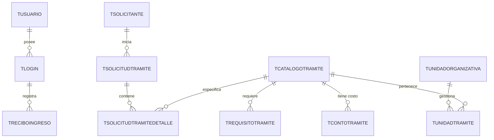

# Plan de Proyecto: Plataforma Web para la Optimización de la Gestión del TUPA de la UNSAAC

Este documento constituye el **Entregable Semestral Nro. 01 (Plan de Proyecto)** para la asignatura de **Desarrollo de Software I** del Programa Académico de Ingeniería Informática y de Sistemas de la Universidad Nacional de San Antonio Abad del Cusco (UNSAAC), semestre 2026-I.

---

## 1. Carátula y Datos Generales

* **Universidad:** Universidad Nacional de San Antonio Abad del Cusco (UNSAAC)
* **Programa Académico:** Ingeniería Informática y de Sistemas
* **Asignatura:** Desarrollo de Software I
* **Docentes Responsables:**
  * Luis Álvaro Monzón Condori
  * Julio Vladimir Quispe Sota
* **Título del Proyecto:** Plataforma Web para la Optimización de la Gestión del TUPA de la UNSAAC
* **Atributo del Graduado a Medir:** AG_C12 - Aplica Teoría de la Ciencia de la Computación y los fundamentos de desarrollo de software para producir soluciones basadas en computadora.
* **Fecha:** Mayo, 2026

---

## 2. Presentación y Ámbito de Aplicación

La presente propuesta técnica detalla el diseño, planificación y estrategia de desarrollo de la **Plataforma Web de Gestión del TUPA (Texto Único de Procedimientos Administrativos)** de la **UNSAAC**. 

La plataforma está diseñada para ser implantada en la comunidad universitaria, abarcando a:
1. **Administrados (Estudiantes de pregrado/posgrado, egresados y público externo):** Quienes interactúan con la plataforma para realizar consultas de requisitos, costos y el registro y seguimiento digital de sus trámites.
2. **Oficinas Administrativas (Decanatos, Direcciones de Escuela, Secretaría General, Dirección de Registro y Servicios Académicos, Unidad de Caja):** Quienes operan el panel de control para la recepción, evaluación, validación de documentos y resolución de solicitudes en sus respectivas competencias.

---

## 3. Descripción de la Problemática

Actualmente, la gestión de trámites administrativos basados en el TUPA en la UNSAAC presenta serias limitaciones que impactan negativamente la experiencia del usuario y la eficiencia institucional:
* **Falta de accesibilidad e información centralizada:** Estudiantes y egresados a menudo encuentran confusa la información sobre requisitos, códigos de pago en bancos y flujos de trámites, recurriendo a consultas presenciales reiteradas.
* **Procesos manuales e ineficientes:** Muchas validaciones (como la verificación manual de comprobantes de pago o de fotos digitales para carnés) ralentizan la atención y sobrecargan al personal administrativo.
* **Carencia de seguimiento en tiempo real:** Los solicitantes no disponen de un canal digital interactivo para conocer el estado exacto de su trámite (e.g., SOLICITADO, EN PROCESO, PAGADO, OBSERVADO, CERRADO), lo que incrementa la incertidumbre y las colas físicas.
* **Limitada visibilidad y control directivo:** Las oficinas administrativas carecen de paneles con reportes gráficos y estadísticas que permitan identificar cuellos de botella en la atención de trámites.

---

## 4. Objetivos del Proyecto

### 4.1. Objetivo General
Desarrollar e implementar una **Plataforma Web Moderna, Intuitiva y Centralizada** para la gestión del TUPA de la UNSAAC, optimizando la administración de trámites, el acceso a la información y el seguimiento de procedimientos administrativos en tiempo real.

### 4.2. Objetivos Específicos
1. **Diseñar una Interfaz Premium (UX/UI):** Crear una interfaz responsiva, accesible y de alta fidelidad que garantice una excelente experiencia de usuario para estudiantes, egresados y administradores.
2. **Facilitar la Consulta Dinámica:** Implementar buscadores avanzados y filtros interactivos para explorar el catálogo de trámites, requisitos específicos y montos asociados extraídos directamente del TUPA.
3. **Digitalizar y Optimizar el Registro de Solicitudes:** Desarrollar un portal seguro que permita a los administrados adjuntar requisitos digitalizados y registrar comprobantes de pago fácilmente.
4. **Implementar Seguimiento en Tiempo Real:** Crear un sistema transparente de trazabilidad de trámites con notificaciones visuales e indicadores del estado de la solicitud.
5. **Panel de Gestión de Oficinas Administrativas:** Proveer a los funcionarios administrativos de herramientas eficientes para validar documentos, observar solicitudes y autorizar resoluciones según la estructura de `tunidadorganizativa` de la UNSAAC.
6. **Generar Analíticas y Reportes:** Construir un dashboard administrativo con estadísticas en tiempo real sobre tiempos de atención, trámites procesados y volumen de solicitudes por oficina.

---

## 5. Arquitectura del Sistema y Diseño de Base de Datos

El sistema se fundamenta en un modelo relacional robusto (derivado de la base de datos `bdtupa20260511.sql`) y se estructura en torno a las siguientes entidades clave:

### Componentes Clave de la Base de Datos:
* **`tcatalogotramite` y `trequisitotramite`:** Centralizan el catálogo oficial de trámites y los requisitos legales (e.g. matrícula, duplicados, constancias).
* **`tmontotramite`:** Administra la vigencia y cuantía de los costos asociados a cada trámite.
* **`tsolicitudtramite` y `tsolicitudtramitedetalle`:** Registran las solicitudes de los administrados, controlando estados (`SOLICITADO`, `EN PROCESO`, `PAGADO`, `ANULADO`, `CERRADO`) y la trazabilidad de los documentos digitales.
* **`tunidadorganizativa` y `tunidadtramite`:** Mapean qué oficina (Decanatos, Secretaría General, etc.) es responsable de calificar y resolver cada tipo de trámite.

---

## 6. Metodología de Trabajo y Plan de Desarrollo

### 6.1. Marco de Trabajo Ágil (Scrum adaptado)
* **Iteraciones Cortas (Sprints de 2 semanas):** Desarrollo de módulos funcionales e independientes.
* **Control de Versiones Riguroso (Git & GitHub):** Uso de ramas por funcionalidad (`feature/`) y fusión controlada mediante pull requests.
* **Pruebas de Software Continuas:** Validación sistemática de cada caso de uso (búsqueda, carga de archivos, flujos de transición de estados) antes del despliegue.

### 6.2. Actividades Principales por Fase

| N° | Actividad | Responsable | Fase |
| :---: | :--- | :--- | :---: |
| 1 | Levantamiento y análisis de requerimientos funcionales del TUPA | Equipo completo | I |
| 2 | Diseño del modelo de datos relacional (BD MySQL) | Equipo completo | I |
| 3 | Diseño de prototipos de interfaces (mockups) | Equipo completo | I |
| 4 | Implementación de GUIs (HTML5/CSS3/JS) — Portal Estudiante | Equipo completo | I |
| 5 | Implementación de GUIs — Portal Administrativo | Equipo completo | I |
| 6 | Configuración del servidor Node.js y rutas de la API REST | Equipo completo | II |
| 7 | Integración del catálogo TUPA con la base de datos MySQL | Equipo completo | II |
| 8 | Desarrollo del módulo de solicitudes y trazabilidad | Equipo completo | II |
| 9 | Desarrollo del módulo de pagos y validación de vouchers | Equipo completo | II |
| 10 | Pruebas funcionales por caso de uso (plan de pruebas) | Equipo completo | II |
| 11 | Despliegue en servidor en la nube (Render / Railway) | Equipo completo | II |
| 12 | Documentación final y preparación de la sustentación | Equipo completo | II |

### 6.3. Infraestructura y Recursos Tecnológicos
* **Frontend:** HTML5 semántico, CSS3 moderno (con variables CSS, flexbox, grid, y efectos dinámicos), y JavaScript nativo de alto rendimiento (ES6+).
* **Backend y API:** Node.js / Express estructurado bajo patrones arquitectónicos limpios (MVC o capas).
* **Base de Datos:** MySQL / MariaDB (importando la estructura relacional de la universidad).
* **Control de Versiones:** Git y GitHub con flujo de ramas `main` / `feature/` / `develop`.
* **Despliegue sugerido:** Servidor en la nube (e.g., Render, Railway o Vercel) con conexión a base de datos gestionada.

---

## 7. Cronograma y Presupuesto Semestral

### 7.1. Cronograma de Actividades (Semestre 2026-I)

| Actividad | Abr S3 | Abr S4 | May S1 | May S2 | May S3 | May S4 | Jun S1 | Jun S2 | Jun S3 | Jun S4 |
| :--- | :---: | :---: | :---: | :---: | :---: | :---: | :---: | :---: | :---: | :---: |
| Análisis de requerimientos | ▓ | ▓ | | | | | | | | |
| Diseño de BD y modelo de datos | | ▓ | ▓ | | | | | | | |
| Prototipado de interfaces | | | ▓ | ▓ | | | | | | |
| **Entregable 1 — Plan de Proyecto** | | | | ▓ | | | | | | |
| Implementación GUI Portal Estudiante | | | ▓ | ▓ | ▓ | | | | | |
| Implementación GUI Portal Administrativo | | | | ▓ | ▓ | ▓ | | | | |
| **Entregable 2 — GUIs Implementadas** | | | | | ▓ | | | | | |
| Desarrollo Backend API REST | | | | | | ▓ | ▓ | | | |
| Integración BD MySQL y módulos | | | | | | | ▓ | ▓ | | |
| Pruebas funcionales y correcciones | | | | | | | | ▓ | ▓ | |
| Despliegue en la nube | | | | | | | | | ▓ | |
| **Entregable 3 — Sistema Funcional** | | | | | | | | | | ▓ |
| Documentación final y sustentación | | | | | | | | | ▓ | ▓ |

### 7.2. Presupuesto Estimado del Proyecto

| Categoría | Recurso | Unidad | Cantidad | Costo Unit. (S/.) | Total (S/.) |
| :--- | :--- | :---: | :---: | :---: | :---: |
| **Hardware** | Laptop de desarrollo (uso compartido) | Equipo | 2 | 0.00 | 0.00 |
| **Software** | VS Code, Git, MySQL Workbench (gratuitos) | Licencia | — | 0.00 | 0.00 |
| **Hosting** | Servidor en la nube — Render/Railway (Plan gratuito) | Mes | 4 | 0.00 | 0.00 |
| **Base de datos** | MySQL gestionado en la nube (Plan gratuito) | Mes | 4 | 0.00 | 0.00 |
| **Dominio** | Subdominio gratuito del proveedor de hosting | — | 1 | 0.00 | 0.00 |
| **Horas de desarrollo** | Trabajo del equipo (2–3 integrantes) | Hora | 120 | 0.00 | 0.00 |
| **Materiales** | Impresión de documentación para entrega | Páginas | 50 | 0.20 | 10.00 |
| **Transporte** | Coordinación presencial entre integrantes | Pasajes | 10 | 2.00 | 20.00 |
| **Internet** | Datos móviles y conexión para desarrollo | Mes | 4 | 30.00 | 120.00 |
| | | | | **TOTAL** | **S/. 150.00** |

> El proyecto utiliza exclusivamente herramientas y plataformas gratuitas (open-source y planes free-tier), por lo que el costo económico directo es mínimo. El principal recurso invertido es el tiempo del equipo de desarrollo.

---

## 8. Evaluación y Monitoreo del Proyecto

### 8.1. Indicadores de Desempeño (KPIs)

| Indicador | Descripción | Meta |
| :--- | :--- | :---: |
| Cobertura de requerimientos | Porcentaje de RF implementados sobre el total definido | 100% |
| Funcionalidades operativas | Casos de uso completamente funcionales al cierre | 6 / 6 |
| Tiempo de respuesta de búsqueda | Tiempo máximo de filtrado del catálogo TUPA | < 1.5 s |
| Reducción de consultas presenciales | Estimación de reducción por digitalización | 60% |
| Despliegue en producción | Sistema accesible desde URL pública en la nube | Sí / No |

### 8.2. Mecanismos de Monitoreo
* **Reuniones de equipo:** Revisión quincenal del avance de cada sprint mediante lista de actividades completadas vs. planificadas.
* **Control de versiones:** Historial de commits en GitHub como evidencia de progreso continuo.
* **Pruebas por entregable:** Validación funcional de cada módulo antes de marcarlo como completado en el cronograma.
* **Retroalimentación del docente:** Incorporación de observaciones de las entregas parciales (Entregables 1 y 2) en la versión final del sistema.

---

## 9. Participantes del Proyecto

### 9.1. Equipo Interno (Desarrolladores)

| Rol | Apellidos y Nombres | Código UNSAAC | Correo Institucional |
| :--- | :--- | :---: | :--- |
| Desarrollador Líder / BD | [Apellido, Nombre] | [Código] | [codigo]@unsaac.edu.pe |
| Desarrollador Frontend / Docs | [Apellido, Nombre] | [Código] | [codigo]@unsaac.edu.pe |

### 9.2. Equipo Externo (Asesores y Stakeholders)

| Rol | Apellidos y Nombres | Institución / Cargo |
| :--- | :--- | :--- |
| Docente responsable | Monzón Condori, Luis Álvaro | UNSAAC — Docente Desarrollo de Software I |
| Docente responsable | Quispe Sota, Julio Vladimir | UNSAAC — Docente Desarrollo de Software I |
| Usuario piloto (administrado) | Estudiante representativo | UNSAAC — Alumno de pregrado |
| Usuario piloto (oficina) | Personal administrativo | UNSAAC — Dirección de Registro Académico |

---

## 10. Aspectos Administrativos

### 10.1. Modalidad de Trabajo
El proyecto se desarrolla en modalidad **presencial y remota** (híbrida), con coordinación a través de las plataformas GitHub (código), WhatsApp (comunicación inmediata) y reuniones en las instalaciones de la UNSAAC cuando sea necesario.

### 10.2. Gestión de Riesgos

| Riesgo Identificado | Probabilidad | Impacto | Estrategia de Mitigación |
| :--- | :---: | :---: | :--- |
| Falta de disponibilidad de los integrantes por evaluaciones académicas | Alta | Medio | Distribución equitativa de tareas con anticipación; avance previo a semanas de exámenes |
| Problemas de conectividad o acceso a la nube | Media | Alto | Mantener una versión local funcional; usar múltiples proveedores de hosting gratuito |
| Cambios en los requisitos por el docente o la UNSAAC | Baja | Alto | Mantener documentación versionada en Git para revertir o ajustar fácilmente |
| Incompatibilidades en la estructura del SQL del TUPA | Media | Medio | Uso de datos extraídos validados (`extracted_tupa_data.json`) como fallback |
| Pérdida de código por fallo de hardware | Baja | Alto | Repositorio remoto en GitHub como respaldo permanente |

### 10.3. Restricciones del Proyecto
* El sistema debe funcionar con las tecnologías permitidas por la asignatura: HTML, CSS, JavaScript, Node.js y MySQL.
* El presupuesto disponible es de **S/. 150.00** (costo mínimo), priorizando herramientas gratuitas.
* El plazo máximo de entrega del sistema funcional es el último mes del semestre 2026-I.

---

## 11. Prototipado

### 11.1. Descripción del Prototipo Funcional
El prototipo de la plataforma se desarrolló directamente como una **interfaz web funcional de alta fidelidad** implementada en HTML5, CSS3 y JavaScript vanilla. La interfaz cubre todos los flujos definidos en los casos de uso y permite la interacción completa del usuario final.

### 11.2. Vistas Implementadas del Prototipo

| Vista / Módulo | Portal | Descripción |
| :--- | :---: | :--- |
| Catálogo de Trámites TUPA | Estudiante | Búsqueda dinámica con tarjetas, filtro por oficina y modal de detalle con requisitos y costos |
| Formulario de Solicitud Digital | Estudiante | Registro de datos del alumno, checklist de requisitos, carga de archivos y registro de voucher |
| Pasarela de Pagos | Estudiante | Selección de método de pago (Banco, Yape, Plin, Visa, Mastercard), generación de código y confirmación |
| Trazabilidad del Trámite | Estudiante | Búsqueda por código de trámite o DNI, línea de tiempo del historial de estados |
| Panel de Control / Dashboard | Administrativo | Contadores KPI, gráfico de barras por dependencia y gráfico donut de distribución de estados |
| Bandeja de Recepción | Administrativo | Tabla filtrable por oficina, modal de calificación y cambio de estado del expediente |
| Analíticas y Reportes | Administrativo | Exportación de reporte general en formato CSV |

### 11.3. Enlace al Prototipo Dinámico
> El prototipo funcional puede ejecutarse localmente abriendo el archivo `index.html` en cualquier navegador web moderno, o iniciando el servidor Node.js con el comando `node server.js` y accediendo a `http://localhost:3000`.

---

## 12. Resultados Esperados

* Una plataforma web estable, responsiva y estéticamente sobresaliente que reduce el tiempo de atención de trámites en un **60%**.
* Centralización del catálogo TUPA, eliminando las consultas físicas redundantes.
* Trazabilidad completa y transparente del trámite para el estudiante, con notificaciones visuales en tiempo real.
* Panel directivo que permite a los decanos y directores de escuela identificar retrasos y cuellos de botella mediante estadísticas claras.
* Sistema desplegado en la nube, accesible desde cualquier dispositivo con conexión a internet, sin necesidad de instalaciones adicionales por parte del usuario.
